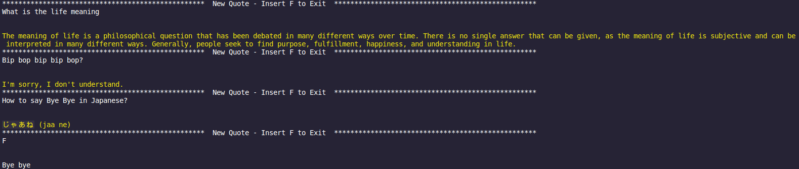

# CHATGPT via API
> Ask any question to the robot

 

The Artificial Inteligence is not mine, this repo it's just a way to use ChatGPT (official site: https://chat.openai.com/)

## Installation

<ol>
    <li>Get your API key on openai site https://platform.openai.com/account/api-keys</li> 
    <li>Clone this project</li> 
    <li>Download Python and an IDE</li> 
    <li>Open your terminal and paste</li> 
    <code>python3 -m venv venv source venv/bin/activate</code> (if you are on Linux)<code> venv/Scripts/Activate</code> (if you are on Windows) <code> pip install -r requirements.txt</code>
    <li>Create a file named ".env" on script directory and type "API_KEY=$YOURKEY$"</li> 
    <li>Run "main.py"</li> 
</ol>

## How to use it

<ol>
    <li>Run "main.py" on your IDE</li> 
    OR  
    <li>Run "python"</li>
</ol>